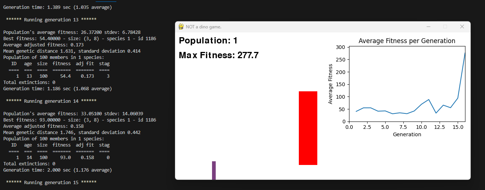

# NEAT Dino Game - NEAT AI Implementation


Watch the video here:
[](https://www.youtube.com/watch?v=6DlvJimHz6w)


## Introduction
This project implements a NEAT (NeuroEvolution of Augmenting Topologies) algorithm to train an AI to play a simple side-scrolling game, reminiscent of the Chrome 'Dino' game. The AI learns to avoid obstacles by jumping or ducking, improving its fitness over time through evolution.

The game is built using Pygame for visualization, NEAT-Python for neural network evolution, and matplotlib for plotting the fitness over generations.

## Features
- **AI-controlled Players**: Multiple AI agents learn to play the game using neural networks evolved via NEAT.
- **Obstacle Avoidance**: Obstacles appear at random intervals and positions, requiring the player to jump or duck.
- **Real-time Visualization**: Watch the AI agents learn and improve over generations.
- **Fitness Graph**: Displays the average fitness per generation in real-time using matplotlib.
- **Neural Network Visualization**: Visualize the best neural network at the end of training using NetworkX.

## Table of Contents
- [Installation](#installation)
- [Requirements](#requirements)
- [Usage](#usage)
- [Configuration](#configuration)
- [How It Works](#how-it-works)
- [Visualizations](#visualizations)
- [License](#license)
- [Acknowledgments](#acknowledgments)

## Installation

### Clone the Repository
```bash
git clone https://github.com/JacoMoolman/NEAT-Dino-Game.git
cd NEAT-Dino-Game
```

### Create a Virtual Environment (Optional but Recommended)
```bash
python -m venv venv
source venv/bin/activate  # On Windows use `venv\Scripts\activate`
```

### Install the Required Packages
```bash
pip install -r requirements.txt
```

Alternatively, if a `requirements.txt` file is not provided:
```bash
pip install pygame neat-python matplotlib networkx numpy
```

## Requirements
- Python 3.x
- Pygame
- NEAT-Python
- Matplotlib
- NetworkX
- NumPy

## Usage
Run the main script to start the game and the NEAT AI training:
```bash
python NEAT-DINOai.py
```
## Configuration
You can adjust several parameters at the top of the script for customization:
```python
MAX_GENERATIONS = 1000   # Maximum number of generations to run
POPULATION_SIZE = 100    # Number of AI players in each generation
GAMESPEED = 600          # Speed of the game
```

- **MAX_GENERATIONS**: The maximum number of generations for the NEAT algorithm to run.
- **POPULATION_SIZE**: The number of AI agents (genomes) in each generation.
- **GAMESPEED**: The speed at which the game runs; higher values make the game run faster.

## How It Works

### Game Mechanics
The player can perform two actions:
- **Jump**: Avoid low obstacles.
- **Duck**: Avoid high obstacles.

Obstacles appear randomly as either low or high and move towards the player. The player must decide to jump, duck, or do nothing based on the incoming obstacle.

### Neural Network Inputs
Each AI agent's neural network receives the following inputs:
- **Player's Y Position**: The vertical position of the player.
- **Is Ducking**: Whether the player is currently ducking (1 for yes, 0 for no).
- **Distance to Next Obstacle**: How far away the next obstacle is.
- **Type of Next Obstacle**: Indicates if the next obstacle is low (1) or high (0).

### Neural Network Outputs
The neural network outputs one of three actions:
- **Do Nothing**: Maintain current state.
- **Jump**: Initiate a jump if on the ground.
- **Duck**: Begin ducking to avoid high obstacles.

### Fitness Function
- **Positive Fitness**: Each frame the player survives without collision increases fitness by 0.1.
- **Negative Fitness**: Colliding with an obstacle decreases fitness by 1.

The goal is to maximize fitness by surviving as long as possible.

### NEAT Algorithm
- **Initialization**: Start with a population of random neural networks.
- **Evaluation**: Each generation, evaluate the fitness of each network by playing the game.
- **Selection**: Networks with higher fitness are more likely to be selected for reproduction.
- **Crossover and Mutation**: Selected networks are combined and mutated to create the next generation.
- **Termination**: The algorithm stops when the maximum fitness threshold is reached or the maximum number of generations is completed.

## Visualizations

### Fitness Graph
A real-time graph displays the average fitness per generation, helping you track the progress of the AI agents.

### Neural Network Visualization
At the end of training, the best-performing neural network is visualized using NetworkX, showing nodes and weighted connections.

## License
This project is licensed under the MIT License. See the LICENSE file for details.

## Acknowledgments
- **NEAT-Python**: A Python implementation of NEAT.
- **Pygame**: For game development and visualization.
- **Matplotlib**: For plotting the fitness graph.
- **NetworkX**: For visualizing the neural network.
- **Inspiration**: The classic Chrome 'Dino' game.

## Contact
For any questions or suggestions, feel free to open an issue or contact me at jacomoolman1890@gmail.com
